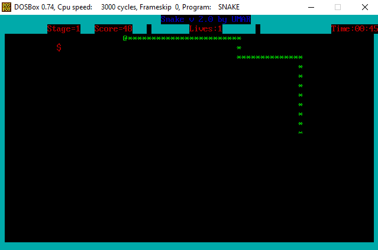

# snake_game
A 2D snake game in NASM x86 Assembly.

To run this application, you will need DOSBOX.

Follow the steps to run the application in DOSBOX:
1. mount x path

Provide the parent path which contains source code e.g D:\Source\Assembly
2. X:

Move to the virtual drive, you can use any letter for virtual drive.
3. nasm snake.asm -o snake.com

Assemble the .asm file into output .com file. Skip this step if .com file is present or ready.
4. snake.com

Run the output file.

Screenshots of application are shown below:

